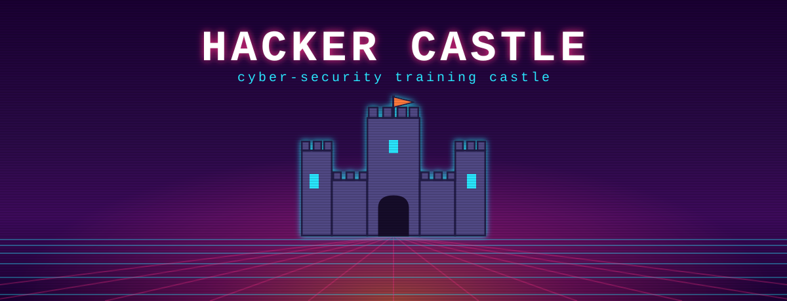

<p align="center">
  
</p>

# 🏰 Hacker Castle

A pixel-art cyber-security training environment for school children (ages 8–16).
A single Docker container exposes a fun, game-styled website. Outside the castle
is the landing page; inside (coming later) are challenge "rooms" and a notice
board of scores.

This repo is the **skeleton starting point** for the castle.

## Tech stack

| Layer    | Choice                         | Why |
|----------|--------------------------------|-----|
| Container| `node:20-bookworm` (Debian)    | Standard, feature-rich base with room for more services later. Not Alpine. |
| Server   | Node.js + Express              | One language (JS) front and back. |
| Database | SQLite via `better-sqlite3`    | Single-file DB, synchronous = readable, prepared statements teach safe SQL. |
| Frontend | Vanilla HTML/CSS/JS, no build  | "View source" shows the real code. Pixel vibe from CSS + pixel fonts. |

The SQLite database is **re-created and seeded fresh on every boot**, so the lab
always starts from a clean state. This is a **single-user** app — one person
plays it — so they just enter a **nickname** (no passwords, no accounts).

### Database schema
Two linked tables:

```
user                          badges
----                          ------
id (0=dragon, 1=student)  ◄──  user_id   (which user earned this badge)
nickname                      id         (unique badge-entry id)
                              name       (the challenge's name)
                              passed     (0 = not earned, 1 = earned)
```

The `user` table holds **at most two rows**, fixed by a `CHECK (id IN (0, 1))`:

- **id 0 — `dragon`**: a reserved castle character, **seeded on every boot**.
  Nothing uses it yet; it's reserved for a future part of the castle.
- **id 1 — the student**: the single real player, created/updated when they
  enter a nickname at the gate. "Run away" deletes only this row (dragon stays).

A user has many `badges` rows — one per challenge — and a challenge is simply
**earned or not** (a 0/1 flag; SQLite has no real boolean).

## Run it

### With Docker (the real deployment)
```bash
docker build -t hacker-castle .
docker run --rm -p 8080:80 hacker-castle
# open http://localhost:8080
```
In the lab, the container gets its own IP and listens on port 80 directly.

### Resetting the lab
The database is **deliberately non-persistent**. There is no volume mount, the
`castle.db` file lives only inside the running container, and `db.js` **rebuilds
it from scratch on every boot**. So to wipe the lab back to a clean slate, just
destroy the container and start a fresh one:

```bash
docker rm -f hacker-castle 2>/dev/null
docker run --rm --name hacker-castle -p 8080:80 hacker-castle
```

(`--rm` already deletes the container — and its data — when it stops.) Nothing
a player does survives a container restart, which is exactly what we want for a
repeatable training lab.

### Locally without Docker (for development)
```bash
npm install
PORT=8080 npm run dev      # http://localhost:8080  (auto-reloads on change)
```
(Port 80 needs admin rights, so use `PORT=8080` when running on your own machine.)

## The look

The gate (outside) keeps the synthwave-terminal style (glitch title, neon
castle). Inside, **The Great Hall** is a more traditional torchlit stone hall
rendered in basic 3D perspective. The shared palette and primitives live in
**`public/css/theme.css`** (linked first on every page).

## Pages

- **Gate** (`/`) — pick a nickname, then "Enter the Castle".
- **The Great Hall** (`/great-hall`) — inside the castle: a subtly 3D stone
  hall with a **Badges** board on the back wall, a row of archway **doors** to
  the rooms, and the **dragon guardian** (animated) standing to the side.
- **Rooms** (`/rooms/<slug>.html`) — one page per challenge (placeholders for
  now):
  - **tutorial** — explains flags/badges and hands you a free first flag.
  - **view-source** — the flag is hidden in the page's HTML source (lesson:
    nothing client-side is secret).
  - **xss** — cross-site scripting (coming soon).
  - **directory-traversal** — path traversal (coming soon).

### Challenges, flags and badges
Challenges are defined server-side in **`challenges.js`** (one entry = one room =
one badge). Each has a secret `flag` that **never leaves the server**. A student
finds a flag in a room and submits it on the Great Hall's badges board; if it
matches, that challenge is recorded in the `badges` table and its badge lights
up — badges start locked/empty and become bright + sparkly when earned.

## Project layout
```
hacker-castle/
├── server.js          # Express: serves the site + the JSON API
├── db.js              # Builds the SQLite database fresh on boot
├── challenges.js      # The challenges (= rooms = badges) + secret flags
├── public/            # The front-end (served as-is, no build step)
│   ├── index.html        # The gate (entry)
│   ├── great-hall.html   # The Great Hall (inside the castle)
│   ├── css/
│   │   ├── theme.css     # Shared identity: palette + primitives
│   │   ├── landing.css   # Gate-only styles
│   │   ├── great-hall.css# Great Hall: room, badges board, doors, dragon
│   │   └── room.css      # Shared styling for the challenge room pages
│   ├── js/
│   │   ├── landing.js    # Builds the castle, runs the entry gate
│   │   └── great-hall.js # Badges board, flag claiming, dragon, room doors
│   ├── img/
│   │   ├── castle-banner.svg  # README/landing banner
│   │   └── hall.svg           # The Great Hall backdrop (perspective room)
│   └── rooms/                 # One placeholder page per challenge
│       ├── tutorial.html
│       ├── view-source.html
│       ├── xss.html
│       └── directory-traversal.html
├── Dockerfile
└── package.json
```
Each real room will later get its own folder under `public/rooms/`.

## API
| Method | Path              | Purpose |
|--------|-------------------|---------|
| GET    | `/api/health`     | Is the castle awake? |
| GET    | `/api/me`         | The current user's `nickname` (or `null`). |
| POST   | `/api/enter`      | Set the user's `nickname`; replies with `{ nickname, returning }`. |
| POST   | `/api/leave`      | "Run away" — forget the user and clear their badges (a logout). |
| GET    | `/api/challenges` | The challenge list + whether the user earned each (no flags). |
| POST   | `/api/flag`       | Submit a secret flag; awards the matching challenge's badge. |

## What's next
- Polish the dragon and the Great Hall details.
- Build the first real challenge room under `public/rooms/`.
- Self-host the pixel fonts so the castle works fully offline.
- When the container grows more services, swap the Dockerfile `CMD` for a
  process supervisor (e.g. `supervisord`).
